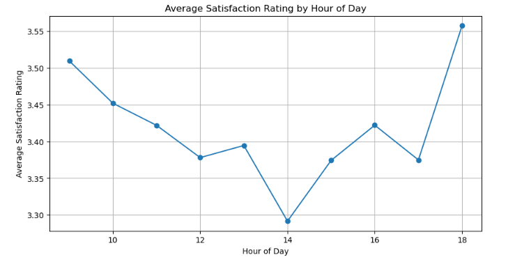

# Call Metrics: Unpacking Support Satisfaction
The Customer Support team at Halo, a subscription-based digital content platform, is analyzing support call data for Q1 of 2021 to understand what drives customer satisfaction. This project explores patterns in call metadata, agent performance, and customer outcomes to identify ways to improve service quality.

## 🔍 Objective

To identify and understand the **key factors influencing customer satisfaction** in a support call environment. The project leverages exploratory data analysis and statistical techniques to draw actionable insights.

---

## 📁 Dataset Overview

The dataset contains the following columns:

* `call_id`: Unique identifier for each call
* `agent`: Agent who handled the call
* `date`, `time`: Date and time of the call
* `topic`: The issue or category of the call
* `answered (y/n)`: Whether the call was answered
* `resolved`: Whether the issue was resolved
* `speed_of_answer_in_seconds`: Time it took to answer the call
* `avgTalkDuration`: Average duration of the call (in seconds)
* `satisfaction_rating`: Rating given by the customer (e.g., 1–5 scale)

---

## ❓ Key Questions

### 🎯 Main Question

* **What factors drive higher customer satisfaction ratings in support calls?**

### 🔍 Supporting Questions

*How does **call duration** relate to satisfaction ratings?
* Does the **speed of answer** impact satisfaction?
* Does the **hour of day** impact satisfaction?
* Does the **day of the week** affect satisfaction ratings?
* Do certain **call topics** consistently result in higher or lower satisfaction?
* Are there noticeable differences in **agent performance** based on satisfaction ratings?

---

## 🧪 Methods Used

* Data Cleaning and Preparation (Pandas, NumPy)
* Exploratory Data Analysis (Matplotlib, Seaborn)
* Correlation and Statistical Analysis
* Grouped Aggregations and Comparisons

---

## 📊 Key Insights

* Shorter calls (<1 min) correlate with higher satisfaction.
* Answer speed has minimal impact on satisfaction.
* Satisfaction consistently dips around 2 PM each day and remains lower on weekends, with no correlation to call volume, suggesting other operational or customer experience factors may be affecting performance.
* Call topic and agent differences show no significant influence on ratings.

Call topic and agent differences show no significant influence on ratings.
---

## 📦 How to Run

```bash
# Clone the repo
git clone https://github.com/Grace-OO/Call_Metrics.git

# Open the notebook
cd Call_Metrics
open notebook.ipynb
```

---

## 📈 Sample Visualizations




---

## 🧑‍💻 Author

**Grace Ojeagbase**
[LinkedIn](www.) | [Portfolio](www.) | [Email](gojeagbase@gmail.com)
